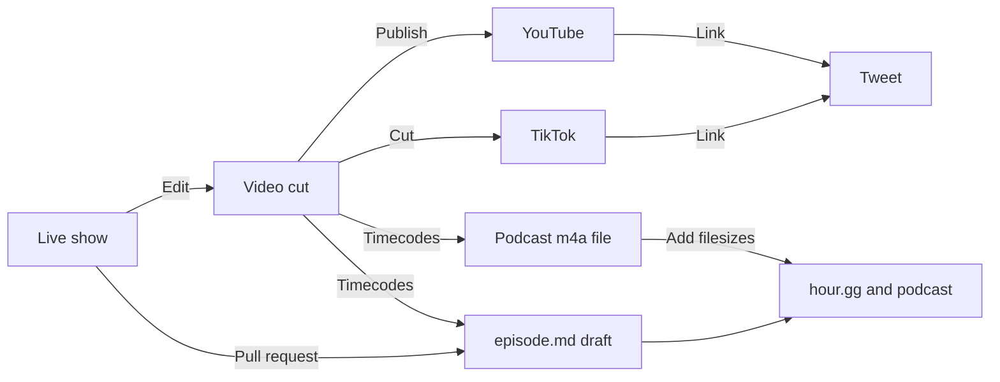

# Community Service Hour

https://hour.gg/

Learn tech, pitch projects, [ask anything](https://twitter.com/intent/tweet?text=Hello%20@fulldecent%20I%20have%20a%20question%20for%20%23CommunityServiceHour), [earn badges](https://hour.gg/#projects).    

| Join live                                                    | Participate                                                  | Add to calendar                                              | Past episodes                                                |
| ------------------------------------------------------------ | ------------------------------------------------------------ | ------------------------------------------------------------ | ------------------------------------------------------------ |
| [Twitch](https://www.twitch.tv/fulldecent), [X Spaces](https://twitter.com/fulldecent), [Rumble](https://rumble.com/c/c-3482588), [YouTube](https://youtube.com/live/CbWMp2VEtsM?feature=share) | [Ask anything](https://twitter.com/intent/tweet?text=Hello%20@fulldecent%20I%20have%20a%20question%20for%20%23NFTCommunityServiceHour), [earn badges](https://hour.gg/#projects) | [ICS](https://calendar.google.com/calendar/ical/liurhb5cqvar2i6n6ekeanap44%40group.calendar.google.com/public/basic.ics), [Google Calendar](https://calendar.google.com/event?action=TEMPLATE&tmeid=NHA4ZXBrZWJkczlsamdmMzJpYmc2MnVqNWxfMjAyMjA2MjFUMjIwMDAwWiBsaXVyaGI1Y3F2YXIyaTZuNmVrZWFuYXA0NEBn&tmsrc=liurhb5cqvar2i6n6ekeanap44%40group.calendar.google.com&scp=ALL), [IRL workshops](https://phor.net/#speaking) | [Apple Podcasts](https://podcasts.apple.com/us/podcast/community-service-hour/id1662422217), [Spotify](https://open.spotify.com/show/3k4PnmjfLiuNo9HpXemCdJ), [TikTok](https://www.tiktok.com/@fulldecent) |

## Production process

When a show is over, please edit the [episode file](_episodes) (anybody can pull request):

* `title` from the [show notes](https://docs.google.com/document/d/1ta_6tSCGfC31iIfhz4bfC_oBKyNZGEdDsZkD-BRXY_Y/edit#)
* `description` from the show notes, up to 400 characters
* `badges` from the show notes
  * Use their X handle, lowercased, and if it is a number (e.g. `037`) put it in quotes (e.g. `"037"`)
  * If new, add this person to [_/data/participants.yml](_/data/participants.yml) and add their profile photo to [assets/participants/](assets/participants/)
* Add quick notes and links below the `---` front matter
  * Add useful keywords and hyperlinks for items we discussed
  * Add hyperlinks (X or homepage preferred) for people that we mention
  * This part requires human research, ChatGPT does not know everybody's profile/homepage URL
  * After the quick notes, add `<!--end of quick notes-->`
  * Paste transcript or other automated notes after this

After the video is edited, fill in:

* `timeline` using [timecode tool](https://hour.gg/timecode-tool)

* `youtube-full` the YouTube URL

* `discussion` the X URL

* `enclosure-length` and `itunes-duration`

  ```sh
  EPISODE=2023-10-10-episode-97
  export SIZE=$(ssh media.phor.net 'stat -c %s **/media/csh/'$EPISODE.m4a)
  # yq -i --front-matter="process" '.enclosure-length = env(SIZE)' _episodes/$EPISODE.md # MESSES UP WHITESPACE
  sed -i '' "s/enclosure-length:.*/enclosure-length: $SIZE/" _episodes/$EPISODE.md
  
  export DURATION=$(ssh media.phor.net 'ffprobe -v error -show_entries format=duration -of default=noprint_wrappers=1:nokey=1 **/media/csh/'$EPISODE.m4a '| cut -d. -f1')
  sed -i '' "s/itunes-duration:.*/itunes-duration: $DURATION/" _episodes/$EPISODE.md
  ```

  

* Upload the audio file, then set `posted: true`

## Details

Here is the production process:



### Upcoming episodes

Draft upcoming episodes like this (do all episodes through the next February to save time):

```sh
# todo: use yq here
NUMBER="62"
EPISODE="2023-02-07-episode-$NUMBER"
TIME="2023-02-07 18:00:00 -0500"
PUBDATE="Tue, 7 Feb 2023 18:00:00 -0500" # New York EST/EDT as appropriate
URL="https://media.phor.net/csh/$EPISODE.m4a"
UUID=$(uuidgen)
cp _drafts/YYYY-MM-DD-episode-N.md _drafts/$EPISODE.md
sed -i '' -e "s/guid: .*/guid: \"$UUID\"/" _drafts/$EPISODE.md
sed -i '' -e "s/title: .*/title: \"Episode $NUMBER\"/" _drafts/$EPISODE.md
sed -i '' -e "s/pubDate: .*/pubDate: \"$PUBDATE\"/" _drafts/$EPISODE.md
sed -i '' -e "s|enclosure-url: .*|enclosure-url: \"$URL\"|" _drafts/$EPISODE.md
sed -i '' -e "s/episode: .*/episode: $NUMBER/" _drafts/$EPISODE.md
```

### Maintenance

```sh
# Roll forward episodes
mv _episodes/2023-10-31-episode-100 _episodes/2023-11-07-episode-100
sed -i '' 's/2023-10-31/2023-11-07/g' _episodes/2023-11-07-episode-100.md
sed -i '' 's/31 Oct 2023/07 Nov 2023/g' _episodes/2023-11-07-episode-100.md
# ... autocomplete rest
```