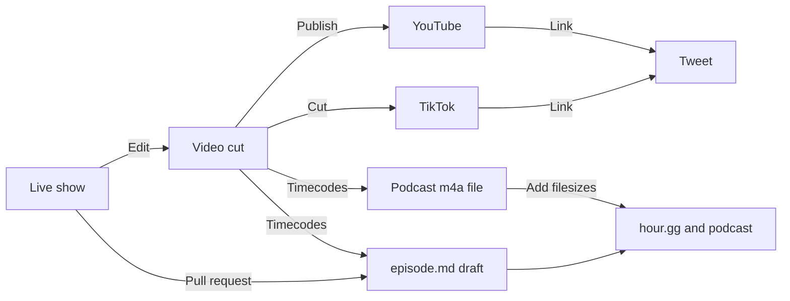

# Community Service Hour

https://hour.gg/

Learn tech, pitch projects, [ask anything](https://twitter.com/intent/tweet?text=Hello%20@fulldecent%20I%20have%20a%20question%20for%20%23CommunityServiceHour), [earn badges](https://hour.gg/#projects).    

| Join live                                                    | Participate                                                  | Add to calendar                                              | Past episodes                                                |
| ------------------------------------------------------------ | ------------------------------------------------------------ | ------------------------------------------------------------ | ------------------------------------------------------------ |
| [Twitch](https://www.twitch.tv/fulldecent), [X Spaces](https://twitter.com/fulldecent), [Rumble](https://rumble.com/c/c-3482588), [YouTube](https://youtube.com/live/CbWMp2VEtsM?feature=share) | [Ask anything](https://twitter.com/intent/tweet?text=Hello%20@fulldecent%20I%20have%20a%20question%20for%20%23NFTCommunityServiceHour), [earn badges](https://hour.gg/#projects) | [ICS](https://calendar.google.com/calendar/ical/liurhb5cqvar2i6n6ekeanap44%40group.calendar.google.com/public/basic.ics), [Google Calendar](https://calendar.google.com/event?action=TEMPLATE&tmeid=NHA4ZXBrZWJkczlsamdmMzJpYmc2MnVqNWxfMjAyMjA2MjFUMjIwMDAwWiBsaXVyaGI1Y3F2YXIyaTZuNmVrZWFuYXA0NEBn&tmsrc=liurhb5cqvar2i6n6ekeanap44%40group.calendar.google.com&scp=ALL), [IRL workshops](https://phor.net/#speaking) | [Apple Podcasts](https://podcasts.apple.com/us/podcast/community-service-hour/id1662422217), [Spotify](https://open.spotify.com/show/3k4PnmjfLiuNo9HpXemCdJ), [TikTok](https://www.tiktok.com/@fulldecent) |

## Production process

When a show is over, please edit the [episode file](_episodes) (anybody can pull request):

* `title` from the [show notes](https://docs.google.com/document/d/1ta_6tSCGfC31iIfhz4bfC_oBKyNZGEdDsZkD-BRXY_Y/edit#)
* `description` from the show notes, up to 400 characters
* `badges` from the show notes
  * Use their X handle, lowercased, and if it is a number (e.g. `037`) put it in quotes (e.g. `"037"`)
  * If new, add this person to [_data/participants.yml](_data/participants.yml) and add their profile photo to [assets/participants/](assets/participants/)
* Add quick notes and links below the `---` front matter
  * Add useful keywords and hyperlinks for items we discussed
  * Add hyperlinks (X or homepage preferred) for people that we mention
  * This part requires human research, ChatGPT does not know everybody's profile/homepage URL
  * After the quick notes, add `<!--end of quick notes-->`
  * Paste transcript or other automated notes after this

After the video is edited, fill in:

* `timeline` using [timecode tool](https://hour.gg/timecode-tool)

* `youtube-full` the YouTube URL

* `discussion` the X URL

* `enclosure-length` and `itunes-duration`

  ```sh
  EPISODE=2023-10-10-episode-97
  export SIZE=$(ssh media.phor.net 'stat -c %s **/media/csh/'$EPISODE.m4a)
  # yq -i --front-matter="process" '.enclosure-length = env(SIZE)' _episodes/$EPISODE.md # MESSES UP WHITESPACE
  sed -i '' "s/enclosure-length:.*/enclosure-length: $SIZE/" _episodes/$EPISODE.md
  
  export DURATION=$(ssh media.phor.net 'ffprobe -v error -show_entries format=duration -of default=noprint_wrappers=1:nokey=1 **/media/csh/'$EPISODE.m4a '| cut -d. -f1')
  sed -i '' "s/itunes-duration:.*/itunes-duration: $DURATION/" _episodes/$EPISODE.md
  ```

  

* Upload the audio file, then set `posted: true`

## Details

Here is the production process:



### Upcoming episodes

Draft upcoming episodes like this (do all episodes through the next February to save time):

```sh
# todo: use yq here
NUMBER="62"
EPISODE="2023-02-07-episode-$NUMBER"
TIME="2023-02-07 18:00:00 -0500"
URL="https://media.phor.net/csh/$EPISODE.m4a"
UUID=$(uuidgen)
cp _drafts/YYYY-MM-DD-episode-N.md _drafts/$EPISODE.md
sed -i '' -e "s/guid: .*/guid: \"$UUID\"/" _drafts/$EPISODE.md
sed -i '' -e "s/title: .*/title: \"Episode $NUMBER\"/" _drafts/$EPISODE.md
sed -i '' -e "s|enclosure-url: .*|enclosure-url: \"$URL\"|" _drafts/$EPISODE.md
sed -i '' -e "s/episode: .*/episode: $NUMBER/" _drafts/$EPISODE.md
```

### YouTube description template

```
PASTE TIMELINE HERE

Join our live weekly call // https://hour.gg // with your cohosts William Entriken and Daniel Tedesco

PASTE KEYWORDS/HASHTAGS HERE

MEDIA CREDITS
“Block Shape Diamond” by Tamiya @ Sketchfab, modified, CC BY 4.0.
“Diamond” by DarkPixel Studios @ Sketchfab, modified, CC BY 4.0.
“Sentence photo” by creativeart @ freepik, modified.
“Scary Island” by Verified Picasso @ YouTube.
“Tech texture vector” by starline @ freepik, modified.
Motion graphics by Gisela Leyva
```

### Do transcript

```sh
#!/bin/zsh

# Define the path to the whisper.cpp directory and model
whisper_path="$HOME/Developer/whisper.cpp"
model_path="${whisper_path}/models/ggml-base.en.bin"

# Loop through all .m4a files in the current directory
for episode_file in *.m4a; do
    # Extract the base name without the extension for the episode
    episode="${episode_file%.m4a}"

    # Process the episode file with ffmpeg and pass the output to whisper
    ffmpeg -i "${episode_file}" -ar 16000 -ac 2 -f wav - | "${whisper_path}/main" --language en --diarize --output-txt --model "${model_path}" --output-file "${episode}" -
done
```


```
FOLDER=~/Sites/hour.gg/_episodes

the next step on improving this is to provide an example input and manually created output of exactly what we want and then include that in the command run!

do this as a tbone, make tbones bigger

for episode_file in *.txt; do
    EPISODE="${episode_file%.txt}" # Strips the .txt extension and assigns to EPISODE
    CONTENT=$(cat "$episode_file")
    
    # Call the OpenAI API and append the output to the markdown file in the desired folder
    openai api chat.completions.create \
        --model gpt-4-1106-preview \
        -g user "$CONTENT" \
        -g system 'Transform the following raw transcript into a well-structured markdown document. Ensure that you include headings for different speakers, bullet points for key topics discussed, and italicize any emphasized words. Also, please correct any obvious grammatical mistakes and format the content to be clear and professional.' \
        --stream | tee -a "$FOLDER/$EPISODE.md"
done
```

### Our tech stack

- [OBS](https://obsproject.com) / [obs-transition-move plugin](https://obsproject.com/forum/resources/move-transition.913/)
- [Elmedia Video Player](https://www.elmedia-video-player.com/) (mirror iPhone to Mac)
- [GSKAIWEN Studio LED Kit](https://amzn.to/3eXJ3Xy) / [Alexis iO2 USB audio](https://www.alesis.com/products/legacy/io2) / Samson microphone / [Lavalier Lapel mic](https://amzn.to/3MWMl9U)
- Twitch / Twitter Spaces / Discord event
- OBS / 1 stream audio / 2 vocal mic / 3 aux mic / 4 laptop mic / 5 desktop audio / 6 other audio
