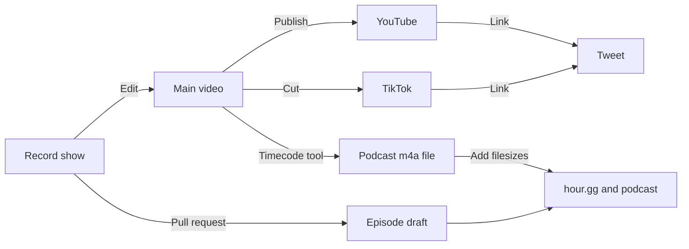

# Community Service Hour

https://hour.gg/

Learn tech, pitch projects, [ask anything](https://twitter.com/intent/tweet?text=Hello%20@fulldecent%20I%20have%20a%20question%20for%20%23CommunityServiceHour), [earn badges](https://hour.gg/#about-us).    

| Join live                                                    | Participate                                                  | Add to calendar                                              | Past episodes                                                |
| ------------------------------------------------------------ | ------------------------------------------------------------ | ------------------------------------------------------------ | ------------------------------------------------------------ |
| [Twitch](https://www.twitch.tv/fulldecent), [X Spaces](https://twitter.com/fulldecent), [Rumble](https://rumble.com/c/c-3482588), [YouTube](https://youtube.com/live/CbWMp2VEtsM?feature=share) | [Send questions](https://twitter.com/intent/tweet?text=Hello%20@fulldecent%20I%20have%20a%20question%20for%20%23NFTCommunityServiceHour), [GitHub project board](https://github.com/users/fulldecent/projects/2), [blog post drafts](https://github.com/users/fulldecent/projects/3) | [Add to calendar ICS](https://calendar.google.com/calendar/ical/liurhb5cqvar2i6n6ekeanap44%40group.calendar.google.com/public/basic.ics), [add to Google Calendar](https://calendar.google.com/event?action=TEMPLATE&tmeid=NHA4ZXBrZWJkczlsamdmMzJpYmc2MnVqNWxfMjAyMjA2MjFUMjIwMDAwWiBsaXVyaGI1Y3F2YXIyaTZuNmVrZWFuYXA0NEBn&tmsrc=liurhb5cqvar2i6n6ekeanap44%40group.calendar.google.com&scp=ALL), [Discord, click "events"](https://discord.com/invite/6nTGNdjQ3B), [join IRL workshops](https://phor.net/#speaking) | [Apple Podcasts](https://podcasts.apple.com/us/podcast/community-service-hour/id1662422217), [Spotify](https://open.spotify.com/show/3k4PnmjfLiuNo9HpXemCdJ), [TikTok](https://www.tiktok.com/@fulldecent) |

## Production process



### Upcoming episodes

Draft upcoming episodes like this (do all episodes for the year to save time):

```sh
NUMBER="62"
EPISODE="2023-02-07-episode-$NUMBER"
PUBDATE="Tue, 7 Feb 2023 18:00:00 -0500" # New York EST/EDT as appropriate
URL="https://media.phor.net/csh/$EPISODE.m4a"
UUID=$(uuidgen)
cp _drafts/YYYY-MM-DD-episode-N.md _drafts/$EPISODE.md
sed -i '' -e "s/guid: .*/guid: \"$UUID\"/" _drafts/$EPISODE.md
sed -i '' -e "s/pubDate: .*/pubDate: \"$PUBDATE\"/" _drafts/$EPISODE.md
sed -i '' -e "s|enclosure-url: .*|enclosure-url: \"$URL\"|" _drafts/$EPISODE.md
sed -i '' -e "s/episode: .*/episode: $NUMBER/" _drafts/$EPISODE.md
```

And also update [_data/upcoming-episodes.yml](_data/upcoming-episodes.yml)

### Draft episode

All this information can be put in immediately during/after the show. Edit the [upcoming episode file](https://github.com/community-service/hour.gg/tree/main/_drafts) to fill in:

* `title` from the show notes
* `description` from the show notes, up to 400 characters
* `badges` from the show notes
  * Use their X handle, lowercased, and if it is a number (e.g. `037` ) put it in quotes (e.g. `"037"`)
  * Add this person to [_/data/participants.yml](_/data/participants.yml) if not already there, and add their profile photo to [assets/participants/](assets/participants/)
* Page body (below front matter)
  * Include a `## Quick notes and links` heading
  * Add an unordered list including useful keywords, hyperlinks for more information on items we discussed and hyperlinks (X or homepage preferred) for people that we mention
  * This part requires human research, ChatGPT does not know everybody's profile/homepage URL
  

### Final episode

Then publish the video and podcast audio and fill in:

* `timeline` using the [timecode tool](https://hour.gg/timecode-tool)
* `youtube-full` the YouTube URL
* `discussion` the X URL
* `enclosure-length`

  ```sh
  PODCAST="Episode 85.m4a"
  SIZE=$(stat -f%z $PODCAST)
  echo $SIZE
  ```
* `itunes-duration`

  ```sh
  PODCAST="Episode 85.m4a"
  DURATION=$(ffprobe -v error -show_entries format=duration -of default=noprint_wrappers=1:nokey=1 $PODCAST | cut -d. -f1)
  echo $DURATION
  ```

Now move the episode from the draft folder to the episodes folder and this episode is now published to all podcasting services as well as the hour.gg website.


## Enrichment

After the episode is produced and published, add the transcript (Whisper + fix ups) to the episode file.

Use text tools to break out the transcript into sections with layer-2 heading (`##`). If they are named properly, the audio on the page will sync with the text.