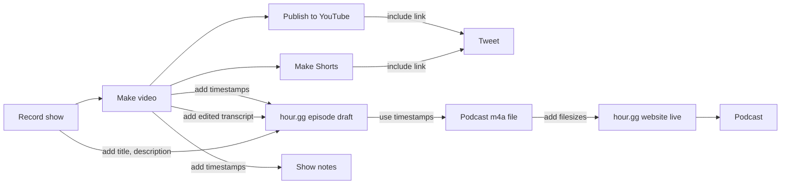

# Community Service Hour

https://hour.gg/

We do **projects**, **take questions** and **discuss** the tech scene each week.

| Join live                                                    | Participate                                                  | Add to calendar                                              | Past episodes                                                |
| ------------------------------------------------------------ | ------------------------------------------------------------ | ------------------------------------------------------------ | ------------------------------------------------------------ |
| [Twitch](https://www.twitch.tv/fulldecent), [X Spaces](https://twitter.com/fulldecent), [Rumble](https://rumble.com/c/c-3482588), [YouTube](https://youtube.com/live/CbWMp2VEtsM?feature=share) | [Send questions](https://twitter.com/intent/tweet?text=Hello%20@fulldecent%20I%20have%20a%20question%20for%20%23NFTCommunityServiceHour), [GitHub project board](https://github.com/users/fulldecent/projects/2), [blog post drafts](https://github.com/users/fulldecent/projects/3) | [Add to calendar ICS](https://calendar.google.com/calendar/ical/liurhb5cqvar2i6n6ekeanap44%40group.calendar.google.com/public/basic.ics), [add to Google Calendar](https://calendar.google.com/event?action=TEMPLATE&tmeid=NHA4ZXBrZWJkczlsamdmMzJpYmc2MnVqNWxfMjAyMjA2MjFUMjIwMDAwWiBsaXVyaGI1Y3F2YXIyaTZuNmVrZWFuYXA0NEBn&tmsrc=liurhb5cqvar2i6n6ekeanap44%40group.calendar.google.com&scp=ALL), [Discord, click "events"](https://discord.com/invite/6nTGNdjQ3B), [join IRL workshops](https://phor.net/#speaking) | [Apple Podcasts](https://podcasts.apple.com/us/podcast/community-service-hour/id1662422217), [Spotify](https://open.spotify.com/show/3k4PnmjfLiuNo9HpXemCdJ), [TikTok](https://www.tiktok.com/@fulldecent) |

## Process



## Draft episodes

New episodes can be drafted like this:

```sh
NUMBER="62"
EPISODE="2023-02-07-episode-$NUMBER"
PUBDATE="Tue, 7 Feb 2023 18:00:00 -0500" # New York EST/EDT as appropriate
URL="https://media.phor.net/csh/$EPISODE.m4a"
UUID=$(uuidgen)
cp _drafts/YYYY-MM-DD-episode-N.md _drafts/$EPISODE.md
sed -i '' -e "s/guid: .*/guid: \"$UUID\"/" _drafts/$EPISODE.md
sed -i '' -e "s/pubDate: .*/pubDate: \"$PUBDATE\"/" _drafts/$EPISODE.md
sed -i '' -e "s|enclosure-url: .*|enclosure-url: \"$URL\"|" _drafts/$EPISODE.md
sed -i '' -e "s/episode: .*/episode: $NUMBER/" _drafts/$EPISODE.md
```

And also update _data/upcoming-episodes.yml

## Production

Draft a new episode and fill in the `title`, `description`, `badges`, `timeline`, `youtube-full`, `discussion`.

* `title` from the show notes
* `description` from the show notes
* `badges` from the show notes
  * Use their Twitter handle, lowercased, and if it is a number (e.g. `037` ) put it in quotes (e.g. `"037"`)
  * Add this person to _/data/participants.yml if not already there, and add their profile photo to assets/participants/
* `timeline` from the show notes (if published)
* `youtube-full` from the show notes (if published)
* `discussion` from the show notes (if published)

Build the website and validate the front matter/YAML using:

```sh
bundle exec jekyll build --drafts
# The --drafts option does not seem to be working. So it is necessary to temporarily move the files in /_drafts to /_episodes before building. Move back before making PR!
```

Now encode the podcast audio file like:

```sh
NUMBER="60"
DATE="2023-01-24"
IN="Episode $NUMBER.m4v"
OUT="$DATE-episode-$NUMBER.m4a"
METADATA=~/Sites/hour.gg/_site/ffmetadata/$DATE-episode-$NUMBER.txt
ffmpeg -i "$IN" -vn -acodec aac -ac 1 -ar 44100 -b:a 160k -af loudnorm=I=-16:TP=-1:LRA=11:print_format=json -f matroska - | ffmpeg -i - -i "$METADATA" -map_metadata 1 -codec copy "$OUT"
```

Update front matter with the media metadata like:

```sh
NUMBER=60
MEDIADIR=~/Desktop

# Set itunes-duration
DURATION=$(ffprobe -v error -show_entries format=duration -of default=noprint_wrappers=1:nokey=1 $MEDIADIR/*-*-*-episode-$NUMBER.m4a | cut -d. -f1)
sed -i '' -e "s/itunes-duration: .*/itunes-duration: $DURATION/" _drafts/*-*-*-episode-$NUMBER.md

# Set enclosure-length
# get size of $MEDIADIR/*-*-*-episode-$NUMBER.m4a in bytes
SIZE=$(stat -f%z $MEDIADIR/*-*-*-episode-$NUMBER.m4a)
sed -i '' -e "s/enclosure-length: .*/enclosure-length: $SIZE/" _drafts/*-*-*-episode-$NUMBER.md
```

Now upload your media to the media storage location. You can publish the episode by moving it from the `/_drafts` folder to the `/_episodes` folder.

## Enrichment

Each episode file should include a `## Quick notes and links` section below the front matter section.

This is in Markdown format, with an unordered list including useful keywords, hyperlinks for more information on items we discussed and hyperlinks (Twitter or homepage preferred) for people that we mention.

Below that begin immediately with another layer-2 heading (`##`) for the first topic. And include a transcript for each topic of the show. This includes time codes, mention of who is speaking. (This will automatically link to jump the episode to that point.)

The required format for these extra headings and text is not decided. (But the quick notes and links part IS decided, go ahead and use that.)