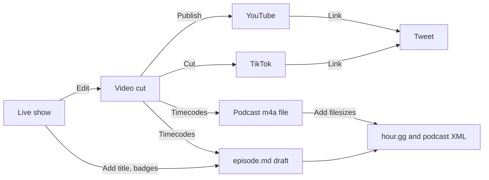

# Postproduction

Here are the steps for each episode.



## Edit the video

Cut the recorded video In DaVinci Resolve.

- [ ] Export timecode markers to `YYYY-MM-DD-episode-###.edl`.
- [ ] Export video to `YYYY-MM-DD-episode-###.mp4` .
  Use "YouTube 1080p" settings.

## Edit episode file

Open it

```sh
code ~/Sites/hour.gg
```

Copy details from the [live show notes](https://drive.proton.me/urls/P51R6H0JF0#s99indgxujhG) into the [episode file](_episodes) (anybody can pull request to do this step):

- [ ] `title`
- [ ] `subtitle`
- [ ] `participants`
- [ ] At the bottom, below `---`, add useful links and keywords for things we discussed
  - [ ] This part requires human research, ChatGPT does not know everybody's profile/homepage URL
- [ ] After `<!--end of quick notes-->` paste the show notes from during the show

## Mixdown & publish the podcast audio

Follow all the specific podcasting [technical requirements](podcast-specifications.md) using these steps below.

```sh
EPISODE_MEDIA=~/Documents/LEARNING\ AND\ WORKING/COMMUNITY\ SERVICE/Episode\ production/Produced
WEBSITE=~/Sites/hour.gg

# Get like 2024-07-23-episode-127
cd $EPISODE_MEDIA
EPISODE=$(basename "$(ls *mp4 | sort -r | head -n 1)" .mp4)
echo $EPISODE
```

Use <https://hour.gg/timecode-tool> with the episode EDL to get and run the `ffmpeg` mixdown code.

And continue along.

```sh
# Get info
cd $EPISODE_MEDIA
export SIZE=$(stat -f %z $EPISODE.m4a)
export DURATION=$(ffprobe -v 0 -show_entries format=duration -of csv=p=0 $EPISODE.m4a | cut -d. -f1)

# Upload audio media file to hosting
REMOTE_HOSTING_PATH='apps.phor.net:public_html/media/csh/'
scp $EPISODE_MEDIA/$EPISODE.m4a $REMOTE_HOSTING_PATH

# Link podcast feed to that media
cd $WEBSITE
yq -i --front-matter="process" '.enclosure-length = env(SIZE)' _episodes/$EPISODE.md
yq -i --front-matter="process" '.itunes-duration = env(DURATION)' _episodes/$EPISODE.md
```

Do VTT transcript.

```sh
# Do the transcript

whisper_path="$HOME/Developer/whisper.cpp"
model_path="${whisper_path}/models/ggml-base.en.bin"

cd $EPISODE_MEDIA
ffmpeg -i $EPISODE.m4a -ar 16000 -ac 2 -f wav - | "${whisper_path}/main" --language en --diarize --output-vtt --model "${model_path}" --output-file $EPISODE -
```

Write a description (draft from the intern):

```sh
export OPENAI_API_KEY="..."
cd $WEBSITE

export DESCRIPTION=$(openai api chat.completions.create --model gpt-5-mini -g user "$(cat tools/description.prompt)" -g user "$(cat $EPISODE_MEDIA/$EPISODE.vtt)")
yq --inplace --front-matter=process ".description = strenv(DESCRIPTION)" _episodes/$EPISODE.md

export YOUTUBE_HASHTAGS=$(openai api chat.completions.create --model gpt-5-mini -g user "$(cat tools/youtube-hashtags.prompt)" -g user "$(cat $EPISODE_MEDIA/$EPISODE.vtt)")
yq --inplace --front-matter=process ".youtube-hashtags = strenv(YOUTUBE_HASHTAGS)" _episodes/$EPISODE.md
```

## Post long-form videos

Use this description template:

```
Episode #9999

PASTE TIMELINE HERE

Join our live weekly call // https://hour.gg

OBVIOUSLY THIS IS A PARODY of joke financial advice. We and everybody else cannot predict the future. 

PASTE KEYWORDS/HASHTAGS HERE

MEDIA CREDITS
“Block Shape Diamond” by Tamiya @ Sketchfab, modified, CC BY 4.0.
“Diamond” by DarkPixel Studios @ Sketchfab, modified, CC BY 4.0.
“Sentence photo” by creativeart @ freepik, modified.
“Scary Island” by Verified Picasso @ YouTube.
“Tech texture vector” by starline @ freepik, modified.
Motion graphics by Gisela Leyva
```

Post to:

- [ ] <https://youtube.com/upload>
  - [ ] Add the URL to the episode file

## Post to X

- [ ] Add the URL to the episode file

Set the `posted=true` and git commit and push!

## Draft upcoming episodes

:warning: This overwrites existing episode files.

```sh
make_episode() { # NUMBER DATE_TIME_OFFSET
    export NUMBER=$1
    export DATE_TIME_OFFSET=$2

    # Validate YYYY-MM-DDTHH:MM:SS-XX:XX format
    if [[ ! $DATE_TIME_OFFSET =~ ^[0-9]{4}-[0-9]{2}-[0-9]{2}T[0-9]{2}:[0-9]{2}:[0-9]{2}-[0-9]{2}:?[0-9]{2}$ ]]; then
        echo "Invalid date-time format, use YYYY-MM-DDTHH:MM:SS-XX:XX"
        return 1
    fi

    DATE=$(echo $DATE_TIME_OFFSET | cut -d'T' -f1)
    BASENAME="$DATE-episode-$NUMBER"
    EPISODE_FILE="_episodes/$BASENAME.md"
    export URL="https://media.phor.net/csh/$BASENAME.m4a"
    export UUID=$(uuidgen)
    cp _drafts/YYYY-MM-DD-episode-N.md $EPISODE_FILE
    yq -i --front-matter="process" '.guid = env(UUID)' $EPISODE_FILE
    yq -i --front-matter="process" '.enclosure-url = env(URL)' $EPISODE_FILE
    yq -i --front-matter="process" '.itunes-episode = env(NUMBER)' $EPISODE_FILE
    yq -i --front-matter="process" '.start-time = env(DATE_TIME_OFFSET)' $EPISODE_FILE
}

# Use New York time zone for time offset (-0400 in Summer EDT, -0500 in EST)
make_episode 130 '2024-08-20T18:00:00-04:00'
make_episode 131 '2024-08-27T18:00:00-04:00'
make_episode 132 '2024-09-03T18:00:00-04:00'
make_episode 133 '2024-09-17T18:00:00-04:00'
make_episode 134 '2024-09-24T18:00:00-04:00'
```
