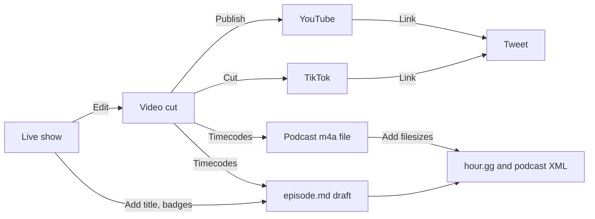

# Postproduction

Here are the steps for each episode.



## Edit the video

Cut the recorded video In DaVinci resolve. Export video to `YYYY-MM-DD-episode-###.mp4` and timecode markers to `YYYY-MM-DD-episode-###.edl`. Then proceed.

## Edit episode file

Open it

```sh
code ~/Sites/hour.gg
```

Copy details from the [live show notes](https://docs.google.com/document/d/1ta_6tSCGfC31iIfhz4bfC_oBKyNZGEdDsZkD-BRXY_Y/edit#) into the [episode file](_episodes) (anybody can pull request to do this step):

- [ ] `title`
- [ ] `subtitle`
- [ ] `badges`
- [ ] At the bottom, below `---`, add useful links and keywords for things we discussed
  - [ ] This part requires human research, ChatGPT does not know everybody's profile/homepage URL
- [ ] After `<!--end of quick notes-->` paste the show notes from during the show

## Mixdown & publish the podcast audio

Follow all the specific podcasting [technical requirements](podcast-specifications.md) with these steps below.

- [ ] Use https://hour.gg/timecode-tool with the episode EDL to get the ffmpeg mixdown code. 
  ```sh
  EPISODE_MEDIA=~/Desktop/CSH*
  WEBSITE=~/Sites/hour.gg
  
  # Get like 2023-10-10-episode-97
  cd $EPISODE_MEDIA
  EPISODE=$(basename "$(ls *mp4 | sort -r | head -n 1)" .mp4)
  echo $EPISODE
  
  ### PASTE IN THE FFMPEG TIMECODE TOOL HERE FROM HOUR.GG/timecode-tool
  ```
  
- [ ] Upload to media hosting

  ```sh
  REMOTE_HOSTING_PATH='lv-shared03.dapanel.net:public_html/media/csh/'
  scp $EPISODE_MEDIA/$EPISODE.m4a $REMOTE_HOSTING_PATH
  ```

- [ ] Save file info to the podcast feed

  ```sh
  cd $WEBSITE
  
  export SIZE=$(ssh media.phor.net 'stat -c %s **/media/csh/'$EPISODE.m4a)
  yq -i --front-matter="process" '.enclosure-length = env(SIZE)' _episodes/$EPISODE.md
  
  export DURATION=$(ssh media.phor.net 'ffprobe -v error -show_entries format=duration -of default=noprint_wrappers=1:nokey=1 **/media/csh/'$EPISODE.m4a '| cut -d. -f1')
  yq -i --front-matter="process" '.itunes-duration = env(DURATION)' _episodes/$EPISODE.md
  ```
  
- [ ] Save the VTT transcript

  ```sh
  whisper_path="$HOME/Developer/whisper.cpp"
  model_path="${whisper_path}/models/ggml-base.en.bin"
  
  cd $EPISODE_MEDIA
  ffmpeg -i $EPISODE.m4a -ar 16000 -ac 2 -f wav - | "${whisper_path}/main" --language en --diarize --output-vtt --model "${model_path}" --output-file $EPISODE -
  ```

- [ ] Write a description (draft from the intern):

  ```sh
  export OPENAI_API_KEY="..."
  cd $WEBSITE
  USER=$(cat tools/description.prompt $EPISODE_MEDIA/$EPISODE.vtt)
  export DESCRIPTION=$(openai api chat.completions.create --model gpt-4-1106-preview -g user "$USER")
  yq --inplace --front-matter=process ".description = env(DESCRIPTION)" _episodes/$EPISODE.md
  ```

## Post long-form videos

Use this description template:

```
PASTE TIMELINE HERE

Join our live weekly call // https://hour.gg

OBVIOUSLY THIS IS A PARODY of joke financial advice. We and everybody else cannot predict the future. 

PASTE KEYWORDS/HASHTAGS HERE

MEDIA CREDITS
“Block Shape Diamond” by Tamiya @ Sketchfab, modified, CC BY 4.0.
“Diamond” by DarkPixel Studios @ Sketchfab, modified, CC BY 4.0.
“Sentence photo” by creativeart @ freepik, modified.
“Scary Island” by Verified Picasso @ YouTube.
“Tech texture vector” by starline @ freepik, modified.
Motion graphics by Gisela Leyva
```

Post to:

- [ ] https://youtube.com/upload
  - [ ] Add the URL to the episode file

## Post to X

- [ ] Add the URL to the episode file

## Draft upcoming episodes

:warning: This overwrites existing episode files.

```sh
make_episode() {
    export NUMBER=$1
    export DATE=$2
    export TIME=$3
    BASENAME="$DATE-episode-$NUMBER"
    EPISODE_FILE="_episodes/$BASENAME.md"
    export URL="https://media.phor.net/csh/$BASENAME.m4a"
    export UUID=$(uuidgen)
    cp _drafts/YYYY-MM-DD-episode-N.md $EPISODE_FILE
    yq -i --front-matter="process" '.guid = env(UUID)' $EPISODE_FILE
    yq -i --front-matter="process" '.enclosure-url = env(URL)' $EPISODE_FILE
    yq -i --front-matter="process" '.itunes-episode = env(NUMBER)' $EPISODE_FILE
    yq -i --front-matter="process" '.time = strenv(DATE) + " " + strenv(TIME)' $EPISODE_FILE
}

# Use New York time zone for time offset
make_episode 115 '2024-03-05' '18:00:00 -0500'
make_episode 116 '2024-03-12' '18:00:00 -0400'
make_episode 117 '2024-03-19' '18:00:00 -0400'
```


```
FOLDER=~/Sites/hour.gg/_episodes

the next step on improving this is to provide an example input and manually created output of exactly what we want and then include that in the command run!

do this as a tbone, make tbones bigger

for episode_file in *.txt; do
    EPISODE="${episode_file%.txt}" # Strips the .txt extension and assigns to EPISODE
    CONTENT=$(cat "$episode_file")
    
    # Call the OpenAI API and append the output to the markdown file in the desired folder
    openai api chat.completions.create \
        --model gpt-4-1106-preview \
        -g user "$CONTENT" \
        -g system 'Transform the following raw transcript into a well-structured markdown document. Ensure that you include headings for different speakers, bullet points for key topics discussed, and italicize any emphasized words. Also, please correct any obvious grammatical mistakes and format the content to be clear and professional.' \
        --stream | tee -a "$FOLDER/$EPISODE.md"
done
```

