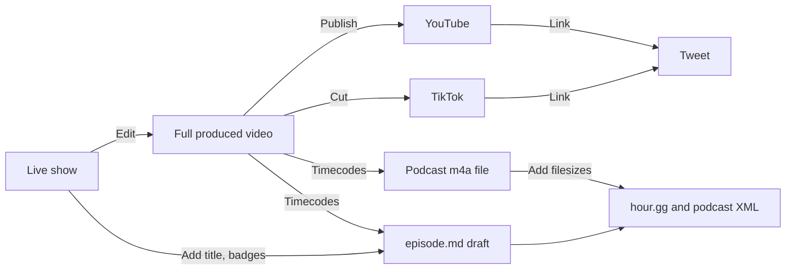

# Postproduction

Here are the steps for each episode.


```mermaid
graph LR
s[Live show]
v[Full produced video]
v2[TikTok]
yt[YouTube]
tw[Tweet]
pm[Podcast m4a file]
hggdraft[episode.md draft]
hggpublished[hour.gg and podcast XML]

v--Publish-->yt
v--Cut-->v2
yt--Link-->tw
v2--Link-->tw
s--Edit-->v
s--Add title, badges-->hggdraft
v--Timecodes-->pm
v--Timecodes-->hggdraft
pm--Add filesizes-->hggpublished
hggdraft-->hggpublished

click yt "https://www.youtube.com/playlist?list=PLaMigeN8Exx-ChNPpO-j6pFQ3F8oJWrBN"
click hgg "https://github.com/community-service/hour.gg/tree/main/_drafts"
click draft "https://github.com/community-service/hour.gg/tree/main/_drafts"
click v2 "https://www.tiktok.com/@fulldecent"
```

## Produce the video with DaVinci Resolve

Cut the video, add chapter markers and save the artifacts.

- [ ] Save to `Season 20XX DaVinci timelines exports`
  - [ ] `YYYY-MM-DD-episode-###.drt` export this from the Media screen
- [ ] Save to `Produced full episodes`
  - [ ] `YYYY-MM-DD-episode-###.edl` export timecode markers from Timeline in cut page
  - [ ] `YYYY-MM-DD-episode-###.mp4` export from export page
    - [ ] Use "YouTube 1080p" settings.
    - [ ] Select Normalize > Optimize to standard

## Create the poster

Use Pixelmator Pro's YouTube poster templates.

- [ ] Save to `Produced full episodes`
  - [ ] `YYYY-MM-DD-episode-###.pxd` save as
  - [ ] `YYYY-MM-DD-episode-###.png` export

## Encode audio and text

Follow all the specific podcasting [technical requirements](podcast-specifications.md) using these steps below.

```sh
EPISODE_MEDIA=/Volumes/FDBeta/Video\ production/Community\ Service\ Hour/Produced\ full\ episodes/
WEBSITE=~/Sites/hour.gg

# Get like 2024-07-23-episode-127
cd $EPISODE_MEDIA
EPISODE=$(basename "$(ls *mp4 | sort -r | head -n 1)" .mp4)
echo $EPISODE
```

Use <https://hour.gg/timecode-tool> with the episode EDL to get and run the `ffmpeg` mixdown code.

Encode VTT transcript

```sh
whisper_path="$HOME/Developer/whisper.cpp"
# model_path="${whisper_path}/models/ggml-base.en.bin"
model_path="${whisper_path}/models/ggml-medium.en.bin"

cd $EPISODE_MEDIA
ffmpeg -i $EPISODE.m4a -ar 16000 -ac 2 -f wav - | "${whisper_path}/main" --language en --diarize --output-vtt --model "${model_path}" --output-file $EPISODE -
```

## Upload media to static hosting

```sh
REMOTE_HOSTING_PATH='apps.phor.net:public_html/media/csh/'
scp $EPISODE_MEDIA/$EPISODE.m4a $REMOTE_HOSTING_PATH
scp $EPISODE_MEDIA/$EPISODE.png $REMOTE_HOSTING_PATH
```

## Draft episode file

- [ ] Use VS Code chat agent

  ```plain
  /draft-episode-file 
  ```

- [ ] Fix participants and get their X profile images if needed and then convert to WebP per instructions.

## Post long-form videos

- [ ] Use VS Code chat agent

  ```plain
  /draft-youtube-description
  ```

- [ ] Post to <https://youtube.com/upload>

  - [ ] Use draft description at `_episodes/$EPISODE.youtube-description.txt`
  - [ ] Add the URL to the episode file
  - [ ] Attach the poster PNG

## Shorts

- [ ] Use VS Code chat agent

  ```plain
  /cut-shorts
  ```

- [ ] Post to <https://www.tiktok.com/tiktokstudio/upload?from=webapp&tab=video>

In VS Code chat:

```
/cut-shorts
```

This extracts three to five clips (30 seconds max each) to the Desktop and creates `_episodes/$EPISODE.shorts-description.md` with descriptions and hashtags for each clip.

## Post to X

- [ ] Use VS Code chat agent

  ```plain
  /draft-x-thread
  ```

- [ ] Post to <https://x.com/compose/post>

  - [ ] Use draft thread at `_episodes/$EPISODE.x-thread.txt`
  - [ ] Add the post URL to the episode `discussion` field

Set the `posted=true` and git commit and push!

## Draft upcoming episodes

If you have a scheduled date for upcoming episodes, then publish those as well (with `posted: false`) so they will publish on our .ics calendar files.

:warning: This overwrites existing episode files.

```sh
make_episode() { # NUMBER DATE_TIME_OFFSET
    export NUMBER=$1
    export DATE_TIME_OFFSET=$2

    # Validate YYYY-MM-DDTHH:MM:SS-XX:XX format
    if [[ ! $DATE_TIME_OFFSET =~ ^[0-9]{4}-[0-9]{2}-[0-9]{2}T[0-9]{2}:[0-9]{2}:[0-9]{2}-[0-9]{2}:?[0-9]{2}$ ]]; then
        echo "Invalid date-time format, use YYYY-MM-DDTHH:MM:SS-XX:XX"
        return 1
    fi

    DATE=$(echo $DATE_TIME_OFFSET | cut -d'T' -f1)
    BASENAME="$DATE-episode-$NUMBER"
    EPISODE_FILE="_episodes/$BASENAME.md"
    export URL="https://media.phor.net/csh/$BASENAME.m4a"
    export IMAGE_URL="https://media.phor.net/csh/$BASENAME.png"
    export UUID=$(uuidgen)
    cp _drafts/YYYY-MM-DD-episode-N.md $EPISODE_FILE
    yq -i --front-matter="process" '.guid = env(UUID)' $EPISODE_FILE
    yq -i --front-matter="process" '.enclosure-url = env(URL)' $EPISODE_FILE
    yq -i --front-matter="process" '.itunes-image = env(IMAGE_URL)' $EPISODE_FILE
    yq -i --front-matter="process" '.itunes-episode = env(NUMBER)' $EPISODE_FILE
    yq -i --front-matter="process" '.start-time = env(DATE_TIME_OFFSET)' $EPISODE_FILE
}

# Use New York time zone for time offset (-0400 in Summer EDT, -0500 in EST)
make_episode 130 '2024-08-20T18:00:00-04:00'
make_episode 131 '2024-08-27T18:00:00-04:00'
make_episode 132 '2024-09-03T18:00:00-04:00'
make_episode 133 '2024-09-17T18:00:00-04:00'
make_episode 134 '2024-09-24T18:00:00-04:00'
```
