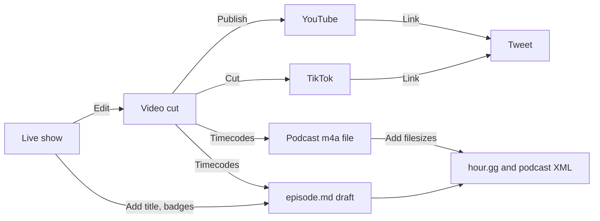

# Postproduction

Here are the steps for each episode.


```mermaid
graph LR
s[Live show]
v[Video cut]
v2[TikTok]
yt[YouTube]
tw[Tweet]
pm[Podcast m4a file]
hggdraft[episode.md draft]
hggpublished[hour.gg and podcast XML]

v--Publish-->yt
v--Cut-->v2
yt--Link-->tw
v2--Link-->tw
s--Edit-->v
s--Add title, badges-->hggdraft
v--Timecodes-->pm
v--Timecodes-->hggdraft
pm--Add filesizes-->hggpublished
hggdraft-->hggpublished

click yt "https://www.youtube.com/playlist?list=PLaMigeN8Exx-ChNPpO-j6pFQ3F8oJWrBN"
click hgg "https://github.com/community-service/hour.gg/tree/main/_drafts"
click draft "https://github.com/community-service/hour.gg/tree/main/_drafts"
click v2 "https://www.tiktok.com/@fulldecent"
```

## Edit the video

Cut the recorded video In DaVinci Resolve.

- [ ] Export timecode markers to `YYYY-MM-DD-episode-###.edl`.
- [ ] Export video to `YYYY-MM-DD-episode-###.mp4` .
  - [ ] Use "YouTube 1080p" settings.
  - [ ] Normalize > Optimize to standard

## Create the poster

Use Pixelmator Pro's YouTube poster templates.

- [ ] Save project to `YYYY-MM-DD-episode-###.pxd`.
- [ ] Export image to `YYYY-MM-DD-episode-###.png`.

## Encode audio and text

Follow all the specific podcasting [technical requirements](podcast-specifications.md) using these steps below.

```sh
EPISODE_MEDIA=/Volumes/FDExtra/Video\ production/Community\ Service\ Hour/Produced\ full\ episodes/
WEBSITE=~/Sites/hour.gg

# Get like 2024-07-23-episode-127
cd $EPISODE_MEDIA
EPISODE=$(basename "$(ls *mp4 | sort -r | head -n 1)" .mp4)
echo $EPISODE
```

Use <https://hour.gg/timecode-tool> with the episode EDL to get and run the `ffmpeg` mixdown code.

Encode VTT transcript

```sh
whisper_path="$HOME/Developer/whisper.cpp"
model_path="${whisper_path}/models/ggml-base.en.bin"

cd $EPISODE_MEDIA
ffmpeg -i $EPISODE.m4a -ar 16000 -ac 2 -f wav - | "${whisper_path}/main" --language en --diarize --output-vtt --model "${model_path}" --output-file $EPISODE -
```

## Upload media to static hosting

```sh
REMOTE_HOSTING_PATH='apps.phor.net:public_html/media/csh/'
scp $EPISODE_MEDIA/$EPISODE.m4a $REMOTE_HOSTING_PATH
scp $EPISODE_MEDIA/$EPISODE.png $REMOTE_HOSTING_PATH
```

## Draft episode file

In VS Code chat:

```
/draft-episode-file 
```

## Post long-form videos

Use this description template:

```
Episode #9999

PASTE TIMELINE HERE

Join our live weekly call // https://hour.gg

OBVIOUSLY THIS IS A PARODY of joke financial advice. We and everybody else cannot predict the future. 

PASTE DESCRIPTION HERE

PASTE KEYWORDS/HASHTAGS HERE

MEDIA CREDITS
“Block Shape Diamond” by Tamiya @ Sketchfab, modified, CC BY 4.0.
“Diamond” by DarkPixel Studios @ Sketchfab, modified, CC BY 4.0.
“Sentence photo” by creativeart @ freepik, modified.
“Scary Island” by Verified Picasso @ YouTube.
“Tech texture vector” by starline @ freepik, modified.
Motion graphics by Gisela Leyva
```

Post to:

- [ ] <https://youtube.com/upload>
  - [ ] Add the URL to the episode file

## Post to X

```sh
Now, considering the medium, give me a tweet thread, I would use to promote this video
```

- [ ] Add the URL to the episode file

Set the `posted=true` and git commit and push!

## Draft upcoming episodes

:warning: This overwrites existing episode files.

```sh
make_episode() { # NUMBER DATE_TIME_OFFSET
    export NUMBER=$1
    export DATE_TIME_OFFSET=$2

    # Validate YYYY-MM-DDTHH:MM:SS-XX:XX format
    if [[ ! $DATE_TIME_OFFSET =~ ^[0-9]{4}-[0-9]{2}-[0-9]{2}T[0-9]{2}:[0-9]{2}:[0-9]{2}-[0-9]{2}:?[0-9]{2}$ ]]; then
        echo "Invalid date-time format, use YYYY-MM-DDTHH:MM:SS-XX:XX"
        return 1
    fi

    DATE=$(echo $DATE_TIME_OFFSET | cut -d'T' -f1)
    BASENAME="$DATE-episode-$NUMBER"
    EPISODE_FILE="_episodes/$BASENAME.md"
    export URL="https://media.phor.net/csh/$BASENAME.m4a"
    export UUID=$(uuidgen)
    cp _drafts/YYYY-MM-DD-episode-N.md $EPISODE_FILE
    yq -i --front-matter="process" '.guid = env(UUID)' $EPISODE_FILE
    yq -i --front-matter="process" '.enclosure-url = env(URL)' $EPISODE_FILE
    yq -i --front-matter="process" '.itunes-episode = env(NUMBER)' $EPISODE_FILE
    yq -i --front-matter="process" '.start-time = env(DATE_TIME_OFFSET)' $EPISODE_FILE
}

# Use New York time zone for time offset (-0400 in Summer EDT, -0500 in EST)
make_episode 130 '2024-08-20T18:00:00-04:00'
make_episode 131 '2024-08-27T18:00:00-04:00'
make_episode 132 '2024-09-03T18:00:00-04:00'
make_episode 133 '2024-09-17T18:00:00-04:00'
make_episode 134 '2024-09-24T18:00:00-04:00'
```

## Shorts

```
Now carefully study the transcripts and the markers and identify the most important snippets

Go ahead and use FFMPEG to extract between three and five snippet videos and save them to my desktop

You are strictly limited to 30 seconds maximum of airtime per output clip. And if you like, you are also welcome when you are creating the clips to concatenate multiple pieces of the origin video. This means that you can splice sentences, etc., so that you meet the time limit

For each of those snippets, give me a good tweet to show them off on X
```

